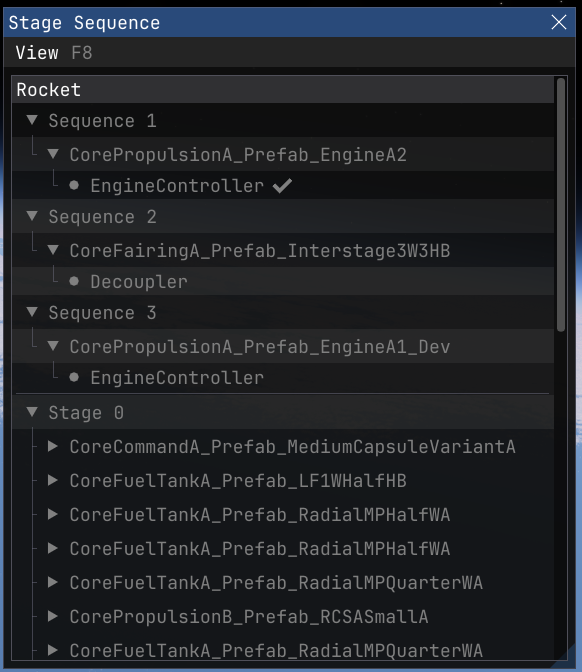
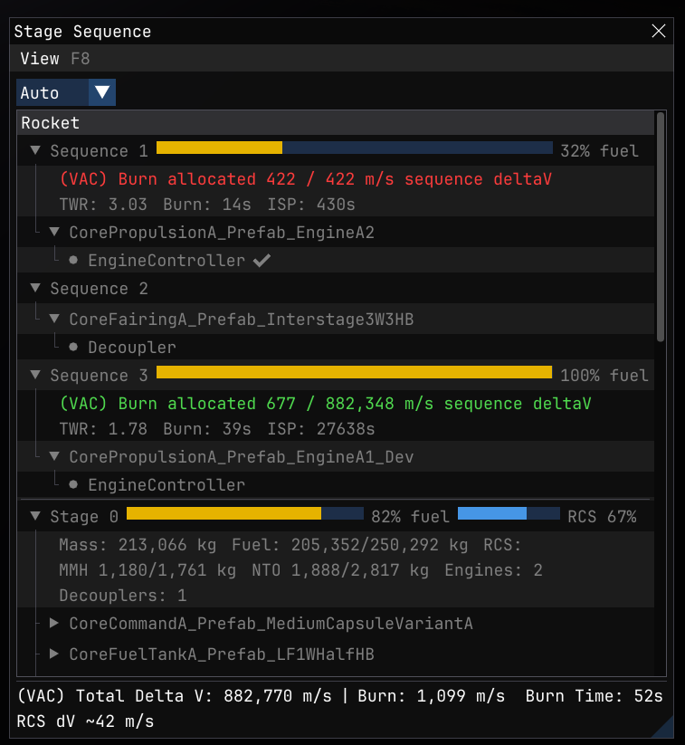

# StageInfo [](https://opensource.org/licenses/MIT)

Extra info in the stock Stage/Sequence window for [Kitten Space Agency](https://ahwoo.com/app/100000/kitten-space-agency).

Keeps the stock layout (Sequences section on top, Stages section below)
and augments each row: Sequences get Delta V / TWR / burn time / ISP,
Stages get fuel pool / mass / engine count / decoupler count. Also adds
a totals footer and a multi-stage-aware burn duration for auto-burns.

<table>
  <tr>
    <th align="center">Stock</th>
    <th align="center">With StageInfo</th>
  </tr>
  <tr valign="top">
    <td></td>
    <td></td>
  </tr>
</table>

This mod is written against the [StarMap loader](https://github.com/StarMapLoader/StarMap).

Validated against KSA build version 2026.4.15.4141.

## Features

- **Per-sequence Delta V**, TWR, burn time, ISP, and fuel fraction on
  each Sequence row.
- **Per-stage fuel pool, mass, engine count, decoupler count** on each
  Stage row.
- **Display modes** Auto / VAC / ASL / VAC+ASL / Planning for previewing
  dV under different ambient conditions (Planning lets you pick any
  celestial body in the current system).
- **Totals footer** with total Delta V, planned burn dV, and burn time.
  Turns red when the planned burn exceeds available dV.
- **Corrected burn duration** for multi-stage burns: the stock game
  computes burn duration as if the full dV came from the current stage,
  which underestimates the time for staged burns. StageInfo rewrites
  the `BurnDuration` shown in the burn gauge and, more importantly, the
  `IgnitionTime` used by the auto-burn logic, so staged burns ignite at
  the correct lead time.

## Installation

1. Install [StarMap](https://github.com/StarMapLoader/StarMap).
2. Download the latest release from the [Releases](https://github.com/Maximilian-Nesslauer/KSA-StageInfo/releases) tab.
3. Extract into `Documents\My Games\Kitten Space Agency\mods\StageInfo\`.
4. The game auto-discovers new mods and prompts you to enable them. Alternatively, add to `Documents\My Games\Kitten Space Agency\manifest.toml`:

```toml
[[mods]]
id = "StageInfo"
enabled = true
```

## Dependencies

- [StarMap](https://github.com/StarMapLoader/StarMap) - mod loader, required at runtime (see [Installation](#installation)).

## Build dependencies

Only needed to build the mod from source.

- [StarMap.API](https://github.com/StarMapLoader/StarMap) (NuGet)
- [Lib.Harmony](https://www.nuget.org/packages/Lib.Harmony) (NuGet)

## Notes

- Sequences are ignition groups (what activates when you press the stage
  key). Stages are jettison groups / fuel pools. The stock window
  already shows both