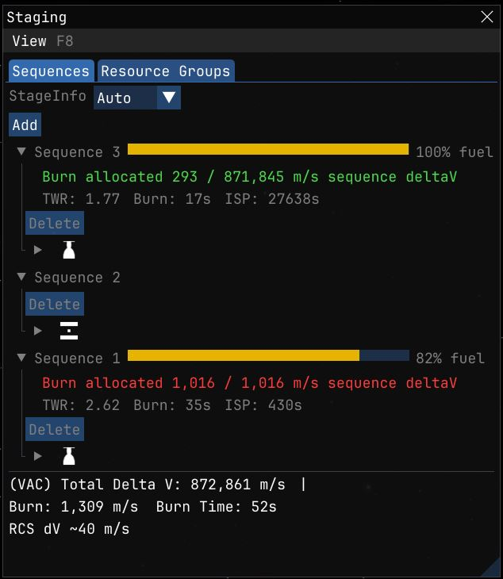
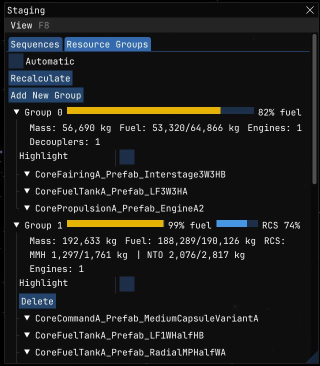
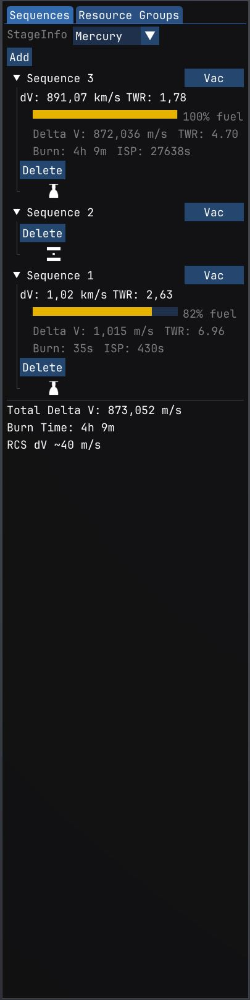
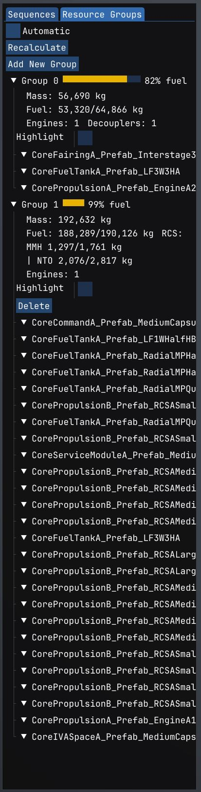

# StageInfo [](https://opensource.org/licenses/MIT)

Extra info and Flight performance readouts in the stock staging window for [Kitten Space Agency](https://ahwoo.com/app/100000/kitten-space-agency).

The stock staging window computes per-sequence Delta V and TWR in the vehicle editor only, with a fixed vacuum / sea-level toggle.

StageInfo adds its readouts to the same window (both the Sequences and the Resource Groups tab) so they also work in flight, and goes deeper:

It adds burn time, ISP, TWR against a selectable body's gravity, live fuel state, RCS budgets, and a corrected multi-stage burn duration for auto-burns.

A mode selector sits at the top of each tab; per-sequence and per-group numbers render inline in the tree (with fuel and RCS bars on each header), and the vehicle totals sit in a footer below.

<table>
  <tr>
    <th align="center">Flight - Sequences</th>
    <th align="center">Flight - Resource Groups</th>
  </tr>
  <tr valign="top">
    <td></td>
    <td></td>
  </tr>
  <tr>
    <th align="center">Editor - Sequences</th>
    <th align="center">Editor - Resource Groups</th>
  </tr>
  <tr valign="top">
    <td></td>
    <td></td>
  </tr>
</table>

This mod is written against the [StarMap loader](https://github.com/StarMapLoader/StarMap).

Validated against KSA build version 2026.7.5.4892.

## Features

- **Per-sequence Delta V, TWR, burn time, ISP, and live fuel fraction**
  in flight. A fuel bar sits on each sequence header; expand a sequence to
  see the numbers inline, above its parts. When a burn is planned, the row
  shows how much of its dV the burn consumes, colored green to red by
  consumption.
- **Per-group mass, fuel pool, engine count, decoupler count** on the
  Resource Groups tab, inline under each group with a fuel bar and an RCS
  bar on the group header. Substances no active main engine can consume
  are listed as RCS entries (e.g. `MMH 1,180/1,761 kg`) with a hover
  tooltip for the full substance name and current/max mass. Shared tanks
  (e.g. LFOX feeding both the main engine and a vernier thruster) stay in
  the main fuel pool so nothing is counted twice.
- **RCS dV budget** as a footer line (`RCS dV ~X m/s`). Hover for an
  engineering tooltip listing effective ISP, total propellant, and
  scalar peak thrust.
- **Display modes** Auto / VAC / ASL / VAC+ASL / Planning for previewing
  dV under different ambient conditions (Planning lets you pick any
  celestial body in the current system).
- **Editor readouts** in the vehicle editor's staging window: the same
  per-sequence Delta V / TWR / burn time / ISP line, with a body selector
  for the TWR reference gravity and a Vacuum toggle for bodies with
  atmosphere. The stock editor also shows dV/TWR, but fixed to standard
  gravity and a vacuum / sea-level toggle; StageInfo's numbers account for
  the selected body's gravity and reachable-only propellant.
- **Totals footer** with total Delta V, planned burn dV, and burn time.
  Turns red when the planned burn exceeds available dV.
- **Corrected burn duration** for multi-stage burns: the stock game
  computes burn duration as if the full dV came from the current stage,
  which underestimates the time for staged burns. StageInfo rewrites
  the `BurnDuration` shown in the burn gauge and, more importantly, the
  `IgnitionTime` used by the auto-burn logic, so staged burns ignite at
  the correct lead time.

## Installation

1. Install [StarMap](https://github.com/StarMapLoader/StarMap).
2. Download the latest release from the [GitHub Releases](https://github.com/Maximilian-Nesslauer/KSA-StageInfo/releases) tab or from [SpaceDock](https://spacedock.info/mod/4256/StageInfo).
3. Extract into `Documents\My Games\Kitten Space Agency\mods\StageInfo\`.
4. The game auto-discovers new mods and prompts you to enable them. Alternatively, add to `Documents\My Games\Kitten Space Agency\manifest.toml`:

```toml
[[mods]]
id = "StageInfo"
enabled = true
```

## Dependencies

| Package | Purpose | Tested version |
| --- | --- | --- |
| [StarMap](https://github.com/StarMapLoader/StarMap) | Mod loader, required at runtime (see [Installation](#installation)) | 0.4.5 |

## Build dependencies

Required only to build the mod from source. Targets **.NET 10**.

| Package | Source | Tested Version |
| --- | --- | --- |
| [StarMap.API](https://github.com/StarMapLoader/StarMap) | NuGet | 0.3.6 |
| [Lib.Harmony](https://www.nuget.org/packages/Lib.Harmony) | NuGet | 2.4.2 |

## Mod compatibility

- Known conflicts: none

## Notes

- Sequences are ignition groups (what activates when you press the stage
  key). Resource groups (called stages in older game versions) are
  jettison groups / fuel pools. The stock window shows both as tabs.

## Community

Thread on the KSA forums: https://forums.ahwoo.com/threads/stageinfo.905/

## Check out my other mods

- [AdvancedFlightComputer](https://github.com/Maximilian-Nesslauer/KSA-AdvancedFlightComputer) - Transfer Planner quick-tools (set Pe/Ap, match/set inclination, circularize), multi-pass burn splitting, and hyperbolic-target support (Oumuamua, 2I/Borisov, 3I/ATLAS) ([forum thread](https://forums.ahwoo.com/threads/advanced-flight-computer.783/))
- [AutoRemoveFinishedBurns](https://github.com/Maximilian-Nesslauer/KSA-AutoRemoveFinishedBurns) - automatically removes finished auto-burns from the burn plan ([forum thread](https://forums.ahwoo.com/threads/autoremovefinishedburns.928/))
- [AutoStage](https://github.com/Maximilian-Nesslauer/KSA-AutoStage) - automatic staging during auto-burns and manual flight, with configurable ignition delays ([forum thread](https://forums.ahwoo.com/threads/autostage.891/))
- [DeltaVMap](https://github.com/Maximilian-Nesslauer/KSA-DeltaVMap) - interactive delta-v subway map and transfer-window planner, auto-generated from the loaded system ([forum thread](https://forums.ahwoo.com/threads/deltavmap.978/))
- [MeasureTools](https://github.com/Maximilian-Nesslauer/KSA-MeasureTools) - click-to-measure ruler, protractor, and surface measuring in the map view ([forum thread](https://forums.ahwoo.com/threads/measuretools.992/))
